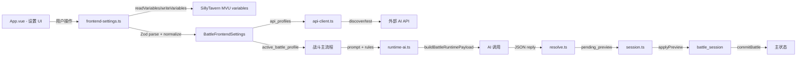

# 战斗设置系统 — UI 布局建议 & 架构参考文档

> 写给参与修改的协作者。看完本文档可以快速理解战斗脚本的设置系统怎么组织、数据怎么流、UI 可以怎么改。

---

## 一、设置系统定位

战斗脚本的"设置"不是全局 SillyTavern 设置，而是**战斗子系统自己的配置**。

```
SillyTavern 主状态（MVU variables）
    └── battle_frontend_settings  ← 战斗脚本的设置存在这里
           ├── api_profiles[]       └── 接口配置列表
           ├── battle_profiles[]    └── 战斗配置列表（含 prompt/规则/字段等）
           ├── active_api_profile_id
           ├── active_battle_profile_id
           └── ui_preferences
```

### 关键设计原则

1. **事务隔离** — 战斗过程中的状态写入 `battle_session`，结束后才提交到主状态。设置不干预战斗事务。
2. **Profile 体系** — API 配置和战斗配置都以"profile"为单位管理，支持多条、切换、增删。
3. **Zod 兜底** — 每个字段都有 `.catch()` + `.prefault()`，读取旧版或脏数据时自动补全而不是崩溃。
4. **多 scope 写回** — 设置更改后会同步写入 `stat_data.battle_frontend_settings` 和裸 `battle_frontend_settings`，确保在 SillyTavern 的各种变量寻址方式下都能读到。

---

## 二、当前 UI 布局

战斗浮窗分成两个主标签页：

```
   ┌──────────────────────────────────┐
   │  [▶ 战斗]  [⚙ 设置]              │  ← activeBattleTab
   └──────────────────────────────────┘
```

设置页内部是**单列滚动布局**，用"药丸导航"切换 section：

```
   ┌──────────────────────────────────┐
   │  < 返回      设置                │  ← 顶部 header
   │  [API] [提示词] [规则] ...        │  ← "药丸"导航
   └──────────────────────────────────┘
   │  (section 内容)                  │
   │  ┌ API 配置 ──────────────┐     │
   │  │ 接口列表  │ 详情编辑    │     │
   │  │ (select) │ 名称/地址/...│     │
   │  │          │ 密钥/模型   │     │
   │  │          │ ...         │     │
   │  └────────────────────────┘     │
   │  ┌ 提示词配置 ────────────┐     │
   │  │ 方案列表  │ 模板列表    │     │
   │  │          │ system/user │     │
   │  │          │ output...   │     │
   │  └────────────────────────┘     │
   │  ...                            │
   └──────────────────────────────────┘
```

### 6 个设置 section

| Section | 需要 BattleProfile？ | 内容 |
|---------|---------------------|------|
| API | 否 | 接口 profile 列表，增删切换，地址/密钥/模型，模型发现，连接测试 |
| 提示词 | 是 | 提示词模板列表（字段分析/单回合/快速整场/战利品），system/user/output 编辑 |
| 规则 | 是 | 运行模式、回合处理、战利品结算，战斗协议文本，toggle 开关 |
| 世界书 | 是 | 世界书导入/刷新，条目选择，已导入管理，开启/禁用 |
| 字段 | 是 | 字段选择树，AI 分析依赖，手动覆盖，预览已选数据 |
| 运行 | 是 | 运行时数据预览，AI 请求层快照，调试开关 |

---

## 三、参考 MoRanJiangHu 后的 UI 改进建议

MoRanJiangHu 的 `SettingsModal.tsx` 是**桌面侧边栏 + 移动端顶部滚动条**设计，两者的关键差异和你可以借鉴的点如下：

### 建议 1：桌面端改用侧边栏导航（替代顶部药丸）

**当前问题**：当前所有 section 共用顶部一行药丸导航，section 一旦增多（现在 6 个，以后可能更多）会溢出换行，在小屏幕上更严重。

**建议方案**（参考 MoRanJiangHu `SettingsModal.tsx`）：

```
   ┌──────┬──────────────────────────────┐
   │ 设置  │  (当前 section 内容)         │  ← 左侧固定 220px
   │──────│                              │
   │ ▶ API│  ┌ API 配置 ────────────┐   │
   │   提示│  │ 当前接口：下拉选择     │   │
   │   规则│  │ 名称 / 地址 / 密钥   │   │
   │   世界│  │ 模型发现 / 连接测试   │   │
   │   字段│  │ 新建/保存/删除       │   │
   │   运行│  └──────────────────────┘   │
   │──────│                              │
   │ [关] │                              │
   └──────┴──────────────────────────────┘
```

**优点**：
- section 再多也不会溢出
- 视觉层次清晰，用户能一眼看到所有可设置项
- 侧边栏可以容纳更多操作入口（返回首页、关闭等）

### 建议 2：当前 API 配置区拆成"列表侧栏 + 详情面板"

**当前问题**：API 配置的"接口列表"和"接口详情"在同一个纵向卡片里，"当前接口"用下拉选择。当接口增多时操作路径长。

**参考**：MoRanJiangHu `ApiSettings.tsx` 布局：

```
   ┌──────┬──────────────────────────────┐
   │ 列表  │  详情                        │
   │──────│                              │
   │ 🔵 接 │  名称  [_______________]    │
   │ 🔵 接 │  类型  [OpenAI 兼容 ▼]      │
   │ 🔵 接 │  地址  [_______________]    │
   │ 🔵 接 │  密钥  [_______________]    │
   │      │  模型  [_______________]    │
   │ [+新]│                            │
   │      │  [拉取模型] [测试连接]      │
   │      │  [保存] [删除]             │
   └──────┴──────────────────────────────┘
```

**建议**：接口 profile 多的时候（3+ 条），左侧列表比下拉选择更直观。如果现在通常只用 1-2 条，则可以暂不改。

### 建议 3：提示词编辑用"选项卡切换"替代当前"按钮列表"

**当前**：4 个 prompt 模板通过竖直按钮列表切换，每个切换后下面的 textarea 内容变。

**建议**：

```
   ┌────────────────────────────────────┐
   │  [字段分析] [单回合] [整场] [战利品] │  ← tab 式切换
   ├────────────────────────────────────┤
   │ 当前：单回合战斗（已启用） [停用]    │
   │                                    │
   │ 系统提示词                         │
   │ ┌────────────────────────────────┐ │
   │ │ (textarea)                     │ │
   │ └────────────────────────────────┘ │
   │ 主提示词                           │
   │ ┌────────────────────────────────┐ │
   │ │ (textarea)                     │ │
   │ └────────────────────────────────┘ │
   │ 输出格式要求                       │
   │ ┌────────────────────────────────┐ │
   │ │ (textarea)                     │ │
   │ └────────────────────────────────┘ │
   └────────────────────────────────────┘
```

**优点**：4 个模板在 tab 行平铺，用户可以快速横向切换对比。当前已有的"紧凑按钮列表"也不错，但 tab 形式更符合大多数用户的心理模型。

### 建议 4：引用预置 API 供应商

MoRanJiangHu 把常见供应商写成了预设：

```typescript
OpenAI兼容方案预设 = {
  siliconflow: { label: 'SiliconFlow', baseUrl: 'https://api.siliconflow.cn/v1' },
  together:    { label: 'Together',    baseUrl: 'https://api.together.xyz/v1' },
  groq:        { label: 'Groq',        baseUrl: 'https://api.groq.com/openai/v1' }
}
```

你当前 App.vue 已经有了 `apiEndpointPresets`（OpenAI / OpenRouter / 本地 / Ollama），可以考虑补上国内常用供应商（SiliconFlow、DeepSeek、零一万物等），让用户直接选省得自己填地址。

### 建议 5：保存反馈可视化

当前保存通过 `hint` 类文本提示（`lastApiMessage` / `lastApiError` / `promptNotice` / `promptError`）。

建议改用**永久性的最近操作记录**或**toast 通知**：
- 操作成功：绿色 toast，2 秒消失
- 操作失败：红色 toast，保留到下次操作
- 遇到校验警告：黄色 toast，可收起

MoRanJiangHu 的 `PromptManager.tsx` 用 `pushNotice` + `setTimeout` 做了简单的 toast 反馈，可以参考。

### 建议 6：AI 调试面板做"可收起/展开"的抽屉

当前"运行" section 的 AI 请求层快照是直接展示的。建议改成默认折叠、点击展开：
- 日常使用不需要看原始 payload
- 调试时才需要展开看 system/user/runtime_payload
- 减少视觉噪音

---

## 四、数据流总览



### 关键文件职责

| 文件 | 做什么 |
|------|--------|
| `App.vue` | 设置 UI 渲染 + 用户交互。绑定数据模型到表单控件。 |
| `frontend-settings.ts` | 设置持久化核心。Zod schema 定义、多源读取、最佳候选选择、profile CRUD、多 scope 镜像写入。 |
| `ai-profile.ts` | TypeScript 类型定义。`BattleApiProfile`、`BattleProfile`、`BattlePromptTemplate` 等纯类型和默认值工厂函数。 |
| `api-client.ts` | 网络层。URL 规范化、连接测试、模型列表发现、流式/非流式请求。不关心 UI。 |
| `runtime-ai.ts` | 运行时 AI 调用组装。从 BattleProfile 读取 prompt 模板、填充 runtime_payload、调用 api-client。 |

---

## 五、设置持久化的关键模式（理解这些才能安全改设置代码）

### 5.1 读取链路

```
App.vue mount
  → frontend-settings createBattleFrontendSettingsAccess()
    → access.read()
      → readSettingsCandidateWithFallback()
        → resolveBattleFrontendSettingsVariableOptions()    生成变量寻址候选列表
          [ {type:'script'}, {type:'script', script_id:'xxx'}, ... ]
        → 遍历各候选，extractSettingsCandidates(variables)  从变量里扒候选
        → selectBestSettingsCandidate()                      选时间戳最新的
        → migrateBattleFrontendSettings()                    版本迁移 + Zod 校验
        → normalizeBattleFrontendSettings()                  去重/补默认/关联检查
```

### 5.2 写入链路

```
用户点"保存"
  → access.upsertApiProfile(draft)
    → mutateAndPersist()
      → bindings.writeVariables(updater, option)
        → 读当前变量
        → migrate + normalize
        → klona 克隆，跑 mutate（增/改 profile）
        → normalize 最终结果
        → writeSettingsToVariables()  写回主路径
        → syncMirroredScopes()        同步到镜像路径
```

### 5.3 为什么保留"多 scope 镜像"

SillyTavern 的变量作用域在不同场景下访问路径不同：

```
stat_data.battle_frontend_settings   ← iframe 内 postMessage 读到的路径
battle_frontend_settings             ← 直接访问脚本变量的路径
```

两端路径必须同步，否则切换页面后设置可能读不到。`syncMirroredScopes` 负责这个。

---

## 六、如果需要修改设置系统，推荐流程

### 6.1 加一个新的设置段

1. 在 `ai-profile.ts` 加字段类型（例如 `BattleFooConfig`）
2. 在 `frontend-settings.ts` 加 Zod schema 行（`.prefault({})` 兜底）
3. 在 `ai-profile.ts` 的 `createDefaultBattleFooConfig()` 加默认值工厂
4. 在 `BattleProfile` 类型和 `BattleProfileSchema` 里加上新字段
5. 确保 `normalizeBattleFrontendSettings` 不会把新字段丢掉（`klona` 会保留未知字段，Zod `.prefault` 只填充缺失值不会删除额外值）
6. 在 App.vue 加新的 `settingsSection` 条目和对应的 `v-show` section
7. 写双向绑定：`v-model="battleProfileDraft.foo.someField"`

### 6.2 改已有设置字段

- 改类型定义
- 改 Zod schema（注意 `.catch()` 和 `.prefault()` 要兼容旧数据）
- 在 App.vue 改对应的表单绑定
- 不需要 migration 函数就无需动版本号（Zod 的 `.catch` 会处理兼容）
- **不要手动修 `frontend-settings.ts` 的 parse logic** — 信任 Zod

### 6.3 加版本迁移

如果 schema 破坏性变更（字段被删除、拆分或重命名）：

1. 递增 `BATTLE_FRONTEND_SETTINGS_VERSION`
2. 在 `migrateBattleFrontendSettings()` 加版本判断和迁移逻辑
3. 迁移逻辑放到 `normalize` 之前

---

## 七、建议的下一步改进（按优先级）

### P0 — 当前可用但没有的大缺口

- **供应商预设**：补充国内厂商预设（SiliconFlow、DeepSeek、零一等），减少用户手填
- **UI 反馈强化**：操作成功/失败用视觉反馈而不是纯文字

### P1 — 体验提升

- **桌面端侧边栏布局**：参考 MoRanJiangHu 的 `SettingsModal.tsx`，侧栏 + 内容区两栏
- **提示词 tab 切换**：4 个模板用 tab 形式平铺
- **调试面板可折叠**：运行 section 的 payload 快照默认收拢

### P2 — 长期

- **设置导入/导出**：MoRanJiangHu `StorageManager.tsx` 有完整的导入导出功能
- **多接口负载均衡**：多个 API profile 之间自动 fallback
- **设置模板市场**：共享战斗配置 profile

---

## 八、你不需要改什么

以下部分已经够好，不需要参考 MoRanJiangHu：

- **数据校验**：你的 Zod `.catch().prefault()` 链比 MoRanJiangHu 的手写标准化函数更健壮
- **持久化架构**：你的 profile 体系 + 多 scope 镜像已经覆盖了 MoRanJiangHu 的全部能力
- **API 客户端**：你的 `api-client.ts` 已经有完善的 URL 规范化、重试、模型发现
- **JSON 修复**：你已经用 AI retry + schema constraint 替代了 MoRanJiangHu 的纯文本修复管线，这在实际场景中更容易成功

---

*这份文档对应代码：`src/旅法师/脚本/战斗/frontend-settings.ts`、`ai-profile.ts`、`src/旅法师/界面/战斗浮窗/App.vue`*
